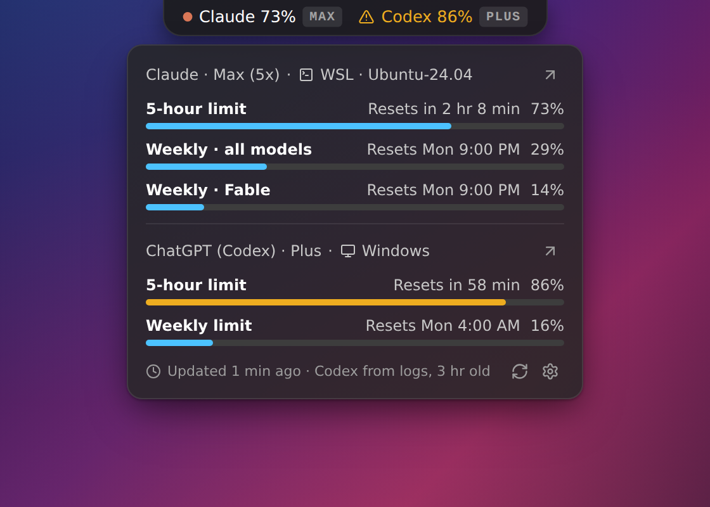
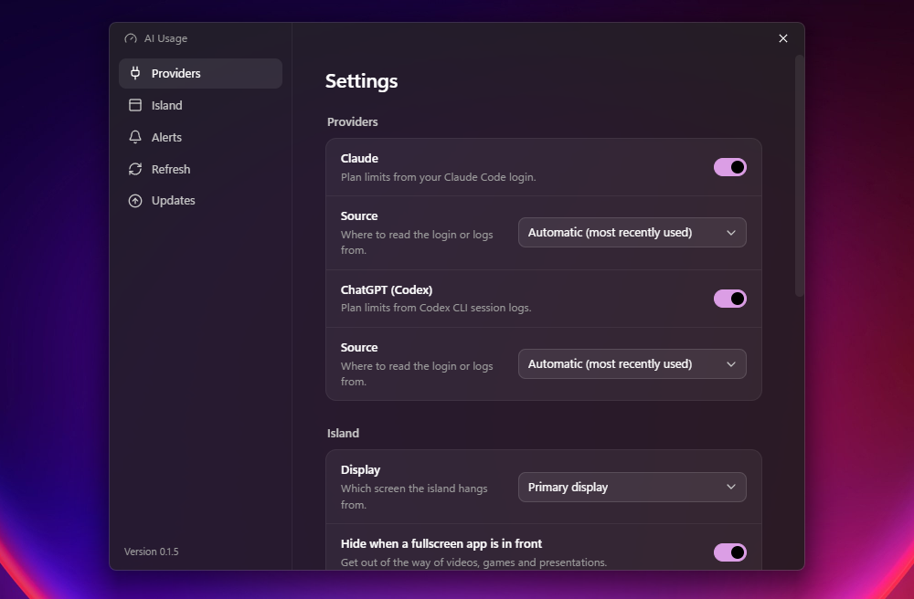

# AI Usage

[](https://github.com/Schoolees/ai-usage/releases/latest)
[](https://github.com/Schoolees/ai-usage/actions/workflows/release.yml)
[](#install)
[](#development)
[](LICENSE)

A notch-style island for Windows that shows your **Claude** and **ChatGPT/Codex** plan usage limits: the 5-hour and weekly windows, at the top of your screen. Hover the pill to see every limit, when it resets, and how close you are.

It reads the logins and logs that the Claude Code and Codex CLIs already keep on your machine, in the Windows home folder and in running WSL distros. It follows your Windows theme and accent color, and alerts you before you hit a limit.

> Early release. Windows 10/11 only.

[Download the latest release](https://github.com/Schoolees/ai-usage/releases/latest) · [Report an issue](https://github.com/Schoolees/ai-usage/issues)

## Screenshots

**Island.** The pill hangs from the top edge of the screen: each provider's 5-hour usage, its plan, and a warning color as a limit fills up.

<p align="center">
  
</p>

**Panel.** Hover the pill to expand it: every limit with its reset time, the source (Windows or WSL), and when the data was last updated. The buttons beside each provider switch its account or open its usage page.

<p align="center">
  
</p>

**Settings.** Providers and their sources, island display, alerts, refresh and updates, following the Windows theme, accent color and Mica.

<p align="center">
  
</p>

<p align="center"><sub>Captured from the running app on Windows 11, all at the same scale: <code>npm run screenshots</code>.</sub></p>

## Features

- **Island at the top of the screen.** A small always-on-top pill shows each provider's 5-hour usage and plan (`MAX`, `PRO`, `PLUS`). Hover to expand a panel with every limit, a progress bar, and reset time ("Resets in 2 hr 8 min", "Resets Mon 1:00 PM").
- **Claude and Codex.** Claude's 5-hour, weekly, and per-model weekly limits; Codex's 5-hour and weekly limits.
- **Windows and WSL.** Finds CLI logins and logs in `%USERPROFILE%` and in every *running* WSL distro. It never starts a stopped distro. You can pick the source in Settings.
- **Alerts.** A Windows notification when a limit crosses your warning (default 80%) or critical (default 95%) threshold, and when a busy window resets. Each alert fires once per window, and every one is written to the log.
- **Follows Windows personalization.** Dark/light mode, accent color, and Transparency effects (Mica backdrop on the settings window), updated live.
- **Stays out of the way.** Clicks pass through everywhere except the pill and open panel. It hides automatically over fullscreen apps, can live on any display, and starts with Windows.
- **Automatic updates.** New releases download in the background from GitHub. The tray offers **Restart to update** as soon as one is ready, or it installs when you quit. Either way the installer shows its progress, AI Usage reopens by itself, and a notification confirms the new version. Turn it off in Settings → Updates.
- **Switch accounts.** The sign-in icon next to each provider (or **Switch account** in the tray) opens a console running that CLI's own sign-in — `claude auth login` or `codex login` — in the Windows home or WSL distro the app is reading. Finish the browser flow and the console closes; the island shows the new account within a minute. If the sign-in fails, the console stays open so you can read why. There's no logout step: signing in replaces the current account, and your MCP server logins are left alone.
- **Tray menu.** Show/hide the island, refresh now, update status, switch account, settings, start with Windows, quit.

## How it gets the numbers

| Provider | Source | Refresh |
|---|---|---|
| Claude | Access token from Claude Code's login (`<home>/.claude/.credentials.json`), used to call the same usage endpoint Claude Code's `/usage` uses | Every 2 minutes (configurable, minimum 1) |
| ChatGPT / Codex | Codex's local app-server `account/rateLimits/read` endpoint, with session logs as a fallback (`<home>/.codex/sessions/YYYY/MM/DD/rollout-*.jsonl`) | Checked every 30 seconds; app-server reads the current account snapshot directly |

Neither usage source is a documented public API. They can change without notice, and the app shows an error or "stale" state rather than a wrong number when they do.

Claude Pro/Max and Claude.ai Team/Enterprise seats use the Claude Code OAuth login and the subscription usage response. The separate Claude Code Analytics Admin API is organization-level, unavailable for individual accounts, and can lag by up to one hour, so it is reserved for a future organization dashboard rather than used for live personal limits. It requires an organization or analytics credential and is never stored in AI Usage settings.

### Privacy and credentials

- Tokens are read only by the Electron main process. They never reach the UI, logs, or any file the app writes.
- The Claude token is sent only to Anthropic's API. Nothing is sent anywhere else, and there is no telemetry.
- The app **never refreshes or rewrites** CLI tokens, so it can't sign your CLI out. When a token expires, the island shows "Login expired · run claude to refresh" until Claude Code refreshes it.
- Switching accounts only starts the CLI's own sign-in. AI Usage never sees or stores the new credentials.
- Log output passes through a redaction filter that removes bearer tokens, API keys, and JWTs.

App data lives in `%APPDATA%\ai-usage\` (`settings.json`, `state.json`, `logs\main.log`).

## Install

Download the latest `ai-usage-setup-<version>.exe` from [Releases](https://github.com/Schoolees/ai-usage/releases), or build it yourself (see below). The setup wizard lets you pick the install folder (default `%LOCALAPPDATA%\Programs\ai-usage`), adds Start Menu and desktop shortcuts, and can start the app when it finishes.

It installs for your Windows account only, with no admin rights. That is deliberate: AI Usage reads your own CLI logins, and a machine-wide install would ask for permission on every automatic update.

The installer is not signed yet, so Windows SmartScreen will warn on first run: choose **More info →
Run anyway**. Signing through [SignPath Foundation](docs/code-signing.md) is set up in the release
workflow and switches on once the certificate is issued.

You need at least one of:

- [Claude Code](https://docs.anthropic.com/en/docs/claude-code) signed in with a Claude Pro/Max plan
- [Codex CLI](https://github.com/openai/codex) signed in with a ChatGPT plan, and used at least once, so logs exist

## Development

Requirements: Node.js **22.12+** (the build tools don't run on older Node; CI uses 24), npm, Windows 10/11 to run the app.

```bash
npm install
npm run dev          # run the app with hot reload (on Windows)
npm test             # unit and component tests (vitest)
npm run typecheck    # tsc for main/preload and renderer
npm run build        # bundle to out/
npm run dist         # build the Windows NSIS installer into dist/
npm run icons        # regenerate build/icon.ico and resources/tray.ico
npm run check:sources # print what each provider resolves to on this machine
npm run screenshots  # recapture docs/screenshots/*.png from the running app
```

`screenshots` runs `scripts/screenshots.ps1`, which shoots the island, the expanded panel and the
settings window from the app as it is actually running. It drives the real pointer, because the
island only expands on hover, so leave the mouse alone while it runs. The images show whatever your
desktop and your plan usage look like at the time: check them before committing.

`check:sources` lists every detected source with the data it yields (status, plan, age, limits). Run it
before a release, or whenever a number looks wrong: it catches provider format drift directly, instead of
waiting for a wrong number to show up in the island.

### Releasing

Releases are built by GitHub Actions, not on a developer machine ([`release.yml`](.github/workflows/release.yml)). Bump the version, commit, and push a tag:

```bash
npm version 0.1.11 --no-git-tag-version
git commit -am "chore(release): v0.1.11"
git tag -a v0.1.11 -m "v0.1.11"
git push origin main v0.1.11
```

The workflow checks that the tag matches `package.json`, runs the typecheck and tests, builds the installer, signs it once SignPath is set up (see [code signing](docs/code-signing.md)), and attaches the installer, its blockmap and `latest.yml` to the release. Installed copies pick it up within six hours, or at their next start.

Anything that changes the installer after electron-builder has run must be followed by `scripts/update-signed-metadata.mjs`. electron-updater rejects a download whose hash doesn't match `latest.yml`, so a stale one breaks updates for everyone.

### Working from WSL

The code and tests run fine in WSL, but the app itself (always-on-top window, tray, notifications, fullscreen detection) must run on Windows. `scripts/sync-to-windows.sh` copies the repo to `C:\dev\ai-usage`, excluding `node_modules`, `out` and `dist`, so Windows keeps its own native modules:

```bash
scripts/sync-to-windows.sh
```

Then in PowerShell:

```powershell
cd C:\dev\ai-usage
npm install
npm run dev
```

If `node -v` on Windows prints a version below 22.12, call a newer Node explicitly, for example `& "C:\Program Files\nodejs\npm.cmd" run dist`.

## Project layout

```
build/
  installer.nsh    NSIS hooks: per-user wizard, update flow, Start Menu shortcut repair
.github/workflows/
  release.yml      builds, signs and publishes a tagged release
scripts/
  check-sources.ts what each provider resolves to on this machine
  screenshots.ps1  captures the README screenshots from the running app
  update-signed-metadata.mjs  rebuilds latest.yml after the installer is signed
src/
  main/            Electron main process
    providers/     provider plugins (claude/, codex/) behind a common interface
    sources/       Windows home + running WSL distro detection
    app.ts         composition root: scheduler, store, alerts, IPC, tray, windows
    island-window.ts, settings-window.ts, tray.ts, notifier.ts
    scheduler.ts, usage-store.ts, alert-engine.ts, system-theme.ts, redact.ts
    updater.ts     electron-updater wrapper: checks, visible install, restart
    switch-account.ts  opens the CLI's own sign-in for a provider's source
  preload/         typed contextBridge API (window.api)
  renderer/
    island/        pill + panel (React)
    settings/      settings window (React)
    palette.css    shared color palette; theme.ts applies the Windows theme
  shared/          types, settings schema (zod), view model, formatting, IPC contract
docs/
  superpowers/specs/   design spec
  superpowers/plans/   implementation plan
  code-signing.md
  manual-test-checklist.md
```

Pure logic (parsers, scheduler, alerts, view model, theme) has no Electron imports and is unit-tested. Electron wiring is covered by the manual checklist.

## Adding a provider

1. Create `src/main/providers/<id>/` with a `plugin.ts` implementing `ProviderPlugin` (`src/main/providers/types.ts`): `detectSources`, `fetch`, interval, and staleness.
2. Put parsing in its own module with fixture-based tests; keep a sample of each odd real-world shape you meet in a `fixtures/` folder (see `src/main/providers/codex/fixtures/`). `fetch` must return a non-ok status instead of throwing for expected failures.
   Prefer whatever the provider itself treats as authoritative (an index, an API) over incidental structure like folder names or file times, and report a non-ok status when the two disagree.
3. Register it in `src/main/providers/index.ts`.

A provider is worth adding only if it has a readable source of real rolling-window limits (not just spend).

## Known limitations

- Windows only. No macOS or Linux build.
- The usage endpoints are undocumented and may change.
- Codex numbers come from local logs. They update only when Codex runs on this machine, and usage from elsewhere isn't counted. A thread you reopen shows its last known numbers until the model's first reply brings fresh ones.
- Switching accounts needs the browser sign-in each time; AI Usage doesn't keep a list of accounts.
- The island is translucent but can't blur the desktop behind it (it has to stay a transparent click-through window).
- The installer is not signed yet, so Windows SmartScreen warns on first run. See [code signing](docs/code-signing.md).

## Testing

`npm test` runs the automated suite. Before a release, go through [`docs/manual-test-checklist.md`](docs/manual-test-checklist.md) on a real Windows desktop: hover behavior, click-through, fullscreen hiding, multi-monitor, notifications, start with Windows, and theme changes.

## License

[MIT](LICENSE) © 2026 Schoolees
